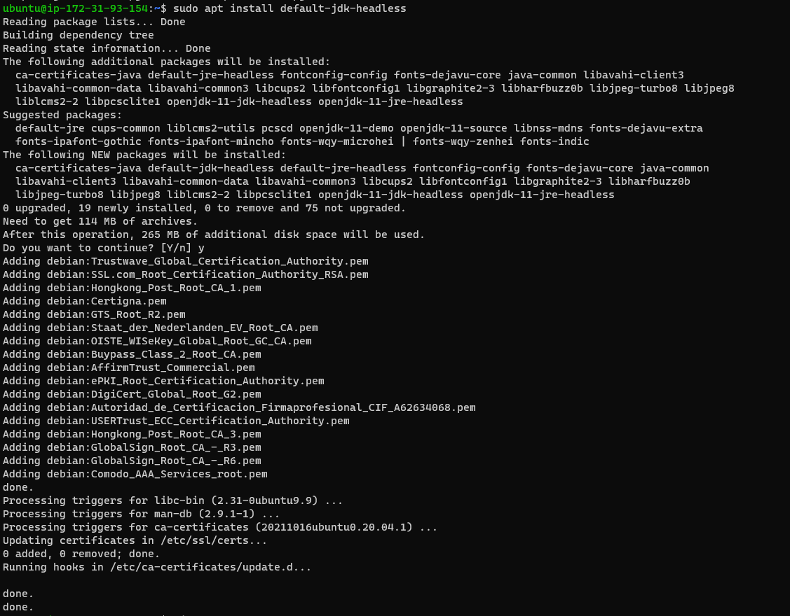
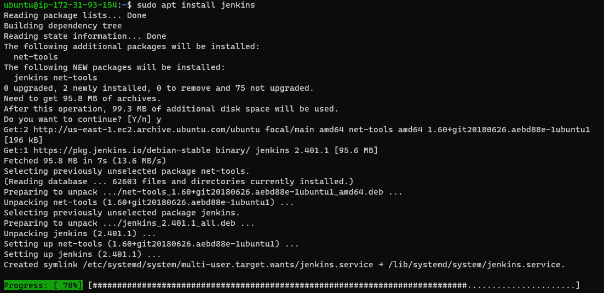
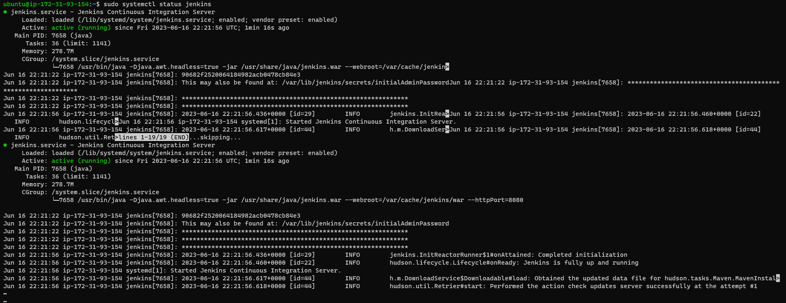
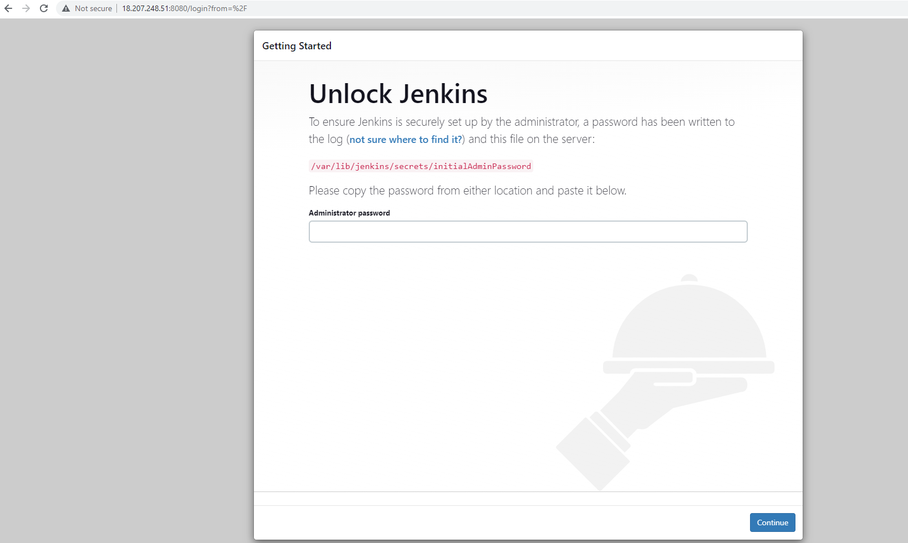
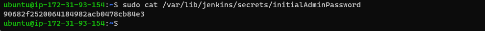
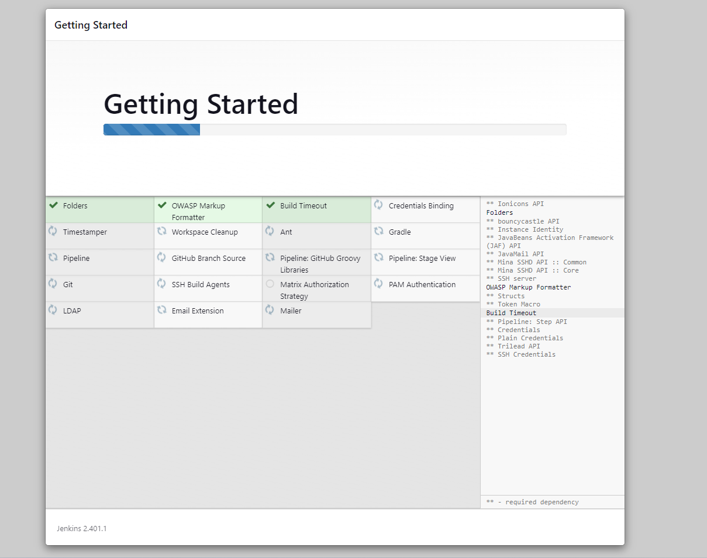
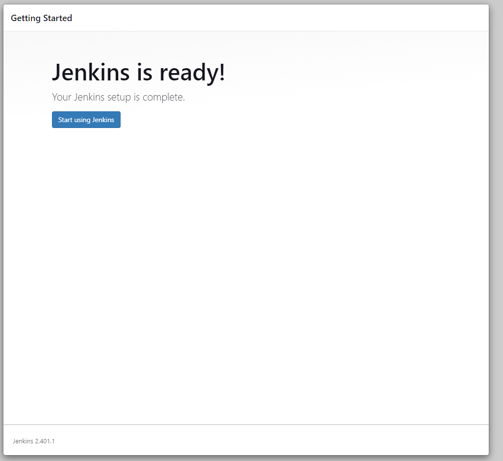

## **Documentation for Project 9**

### Installing JDK
`sudo apt update`
`sudo apt install default-jdk-headless`

### Jenkins Installation
`sudo apt update`
`sudo apt-get install jenkins`

### Jenkins Up and running
`sudo systemctl status jenkins`

## Jenkins Initial Setup

### Accessing jenkings from Browser
`http://<Jenkins-Server-Public-IP-Address-or-Public-DNS-Name>:8080`

`sudo cat /var/lib/jenkins/secrets/initialAdminPassword`

### Suggested Plugin Installation

### Jenkins Setup Complete
